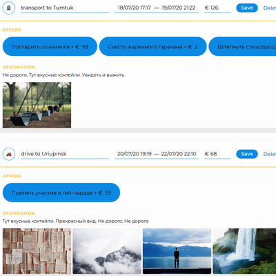

# Личный проект «Большое путешествие» (WIP)

* Студент: [Антон Леонидович](https://up.htmlacademy.ru/ecmascript/11/user/948947).
* Наставник: [Михаил Пушков](https://htmlacademy.ru/profile/id638545).

---
### Описание
«Большое путешествие» — сервис для путешественников. Проект интенсива *«JavaScript. Архитектура клиентских приложений»*. Демонстрация навыков программирования, ООП, автоматизации, компонентов. Дизайн, контент, HTML и CSS - собственность HTML-академии. Весь JavaScript-код полностью мой. Проект находится в стадии разработки и готов только процентов на 40.

[Посмотреть готовую работу](https://utavegu.github.io/948947-big-trip-11/public/)

---

